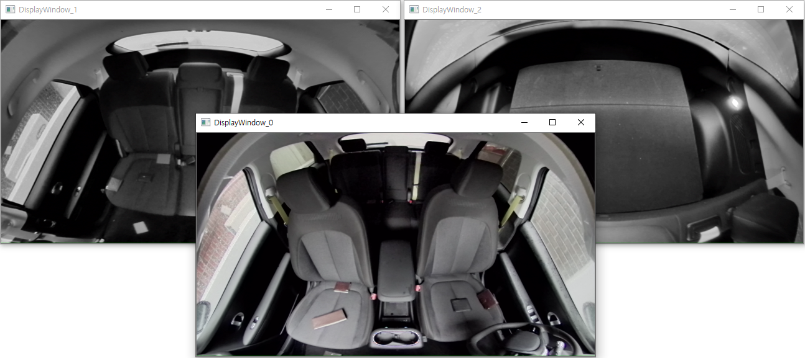
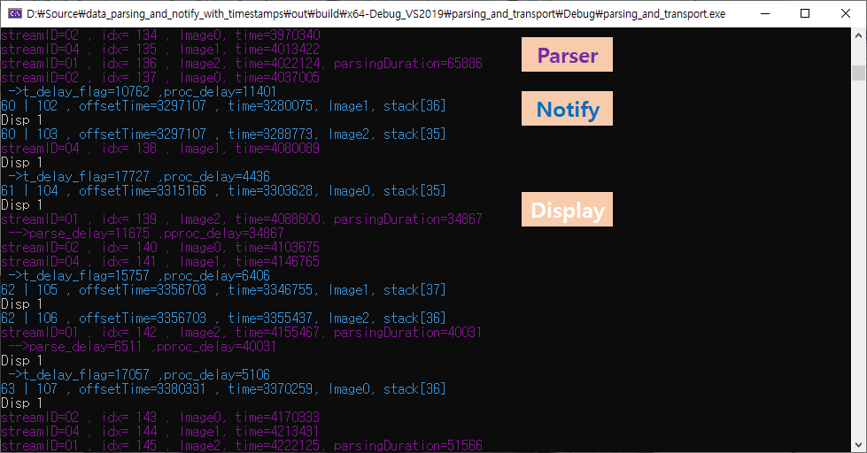

# data_parsing_and_notify_with_timestamps
이 프로젝트는 ADTF(Automotive Data and Time-Triggered Framework) DAT로 
만들어진 Streaming데이터를 파싱하여 하여보고, 
TimeStamp에 맞게 notify하도록 만들어 보았다. 
추가적으로 notify된 이미지를 rendering화면에 출력하여, 파싱이 정상적으로 됬는지 검증할수 있도록 구현해보았다. 

In this project, I tried to parse and report the streaming data made  
with ADTF (Automotive Data and Time-Triggered Framework) DAT,   
and to notify according to TimeStamp.  
In addition, the notified image is output to the rendering screen,  
so that it can be verified whether the parsing is normal.  

## Output
ImageSlot #0,#1,#2 1280x720x2ch 15fps YUVU format</img>
ImageSlot #0,#1 1280x964x1ch 54fps GRAY format</img>
LogResult</img>

## Function
1. ADTF DAT parsing streaming-data using ADTFStreaming library
2. Gathering streaming-data with timestamp
3. Scheduling and transport on time (thread)
4. Rendering streaming-data using opencv (thread) 

## How to use
1. **parsing_and_transport**  
usage:  
parsing_and_transport.exe arg1 [arg2]  
arg1 - source-DAT-File1   
arg2 - source-DAT-File2  
2. **makeDat.exe**  
usage:  
makeDat.exe arg1 arg2 [arg3]  
arg1 - source-DAT-File   
arg2 - destination-DAT-File   
arg3 - save-percentage: default 100  

## License
이 프로젝트는 아파치 2.0 라이센스를 따르고 있다. 그리고 adtf streaming library(MPL-2.0)와 opencv(BSD-3-Clause)와 를 사용하고 있다.

This project is under the Apache 2.0 license. And adtf streaming library (MPL-2.0) and opencv (BSD-3-Clause) are used.

# Reference and code
https://www.elektrobit.com/products/automated-driving/eb-assist/adtf/
https://support.digitalwerk.net/adtf_libraries/adtf-streaming-library/v2/api/page_whats_new.html
https://opencv.org/  
**DAT-file made by LGE (ex)cms_example_short.dat, het_example_short.dat)) - do not use commercial**

